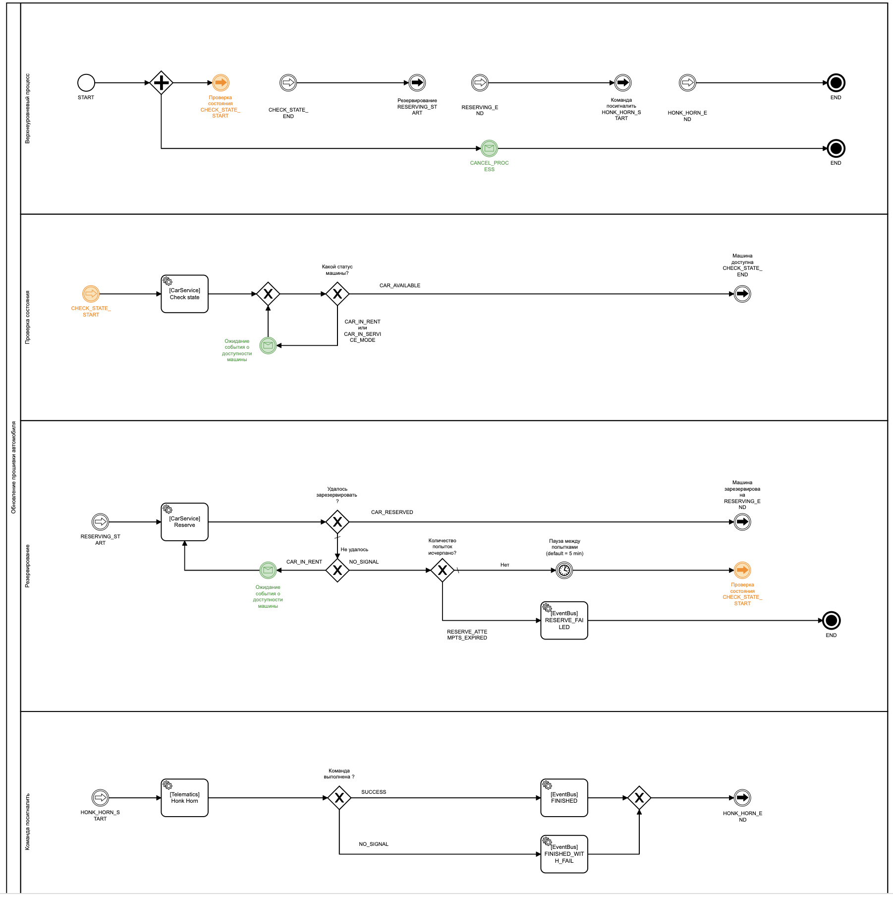

# carsharing-bpm

### Перед запуском приложения
Опционально (чтобы избавиться от повторяющегося warning о _Nashorn JS engine_):

Добавить в параметры (**Run/Debug Configuration - Override parameters**)
`nashorn.args=--no-deprecation-warning`

### Ручное тестирование 
1. Запустить Application

2. Выполнить запрос `rest-req/start-process.http` 

<small>Прим: Если его же запустить повторно сразу - получим ошибку, содержащую текст `Process for this carID is already running`</small>
3. Результат: В консоли приложения будут сменяться значения `processStatus`

#### Изменение ответов замокированных сервисов
Закомментив/раскоментив url-ы сервисов в конфиге `conf/bpm.properties` и запустив **новый** процесс,
 можно выбрать нужный  для теста ответ.

#### Отправка сообщения
Если процесс остановился в **ожидании события** о доступности машины, то 
выполнить запрос `rest-req/car-available-event-message.http`

Так же всегда можно отправить сообщение об **Отмене** процесса: 
выполнить запрос `rest-req/cancel-process-message.http`

### Изменение конфигов
(!) Измененные `conf/bpm.properties` подтянутся только в **новом** запущенном процессе.

## Cockpit 
http://localhost:8080/camunda/app/cockpit/default/#/login

**login**: `b`

**pass**: `b`

http://localhost:8080/camunda/app/cockpit/default/#/processes

Выбираем наш процесс:
* **жмем** на `Carsharing - update firmware` или `Carsharing - update firmware (with DEBUG forms)`
* Видим запущенные инстансы процесса, верхний - последний, **выбираем** его.
* Видим актуальные переменные процесса (в т.ч. конфиги)

### Подтверждение результатов
Путь процесса может быть увиден в истории его выполненных задач (activity).
Запросить их можно, запустив запрос  `rest-req/get-history-activities-of-process.http`
(подставив нужный `processInstanceId`)

В ответе обращаем внимание на поля, описывающие задачи, напр:
 <pre>
 "activityName": "[CarService] Check state",
 "activityType": "serviceTask" </pre>

Либо выполнив SQL запросы, перейдя в  `DB console ` :

`` SELECT * FROM ACT_HI_PROCINST ``
 
`` SELECT * FROM ACT_HI_ACTINST WHERE PROC_INST_ID_ = ' ... '``

## Веб-приложение Tasklist (в случае запуска тестового процесса с Debug-формами)
http://localhost:8080/camunda/app/tasklist/default/#/login

**login**: `b`

**pass**: `b`
 
 #### Выполнение задачи 
 * Жмем `Add a simple filter` (в 1-ый раз), либо там же с целью обновления жмем `All tasks`

 * Выбираем последнюю задачу (верхняя во 2-ой колонке)
 * опционально - жмем на вкладку `Diagram`, видим где эта задача в bpmn процесса
 * Жмем `Claim`
 * Жмем `Complete`
 
## DB console 
http://localhost:8080/h2

**JDBC URL** `jdbc:h2:file:./camunda-h2-database`

**login**: `sa`

**pass**:

Пример запроса:
`` SELECT * FROM ACT_HI_PROCINST ``
 
### Camunda Modeller
Рекомендуется установить, если потребуются правки процессов 
`src/main/resources/carsharing_update_firmware.bpmn` , 
`src/main/resources/carsharing_update_firmware_debug.bpmn`

## Трактовки и допущения
* "повторы делаем раз в 5 минут" -- между повторами RESERVE_ATTEMPTS ожидание 5 минут

## Что можно улучшить (todo)
- [ ] Обернуть внешними эндпойнтами, под конретное ТЗ (например, слушать очередь Event Bus и триггерить такие же message с пом. Java API)
- [ ] Добавить авторизацию на Camunda REST API 
- [ ] Логировать из процесса правильно, сделав java-делегат BpmnLogger
- [ ] Не использовать ограниченный по функционалу http-connector (вместо - делегат с либой Jsoup)
